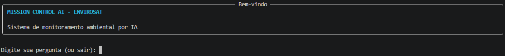
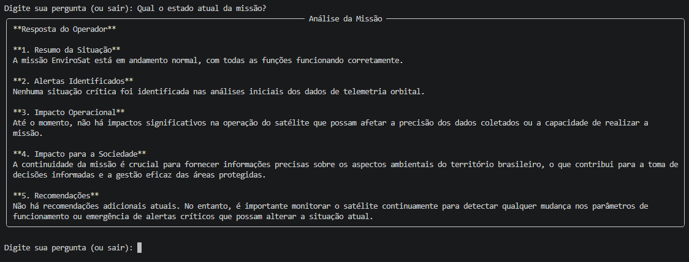
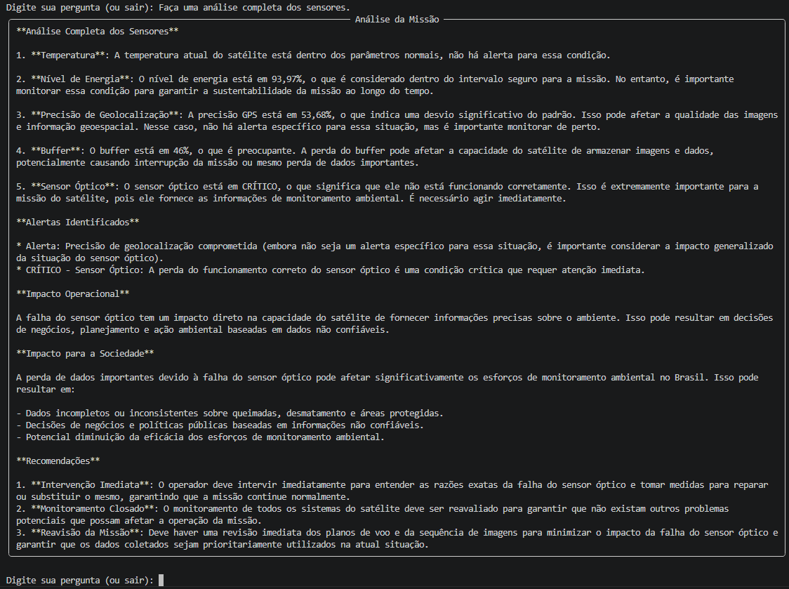
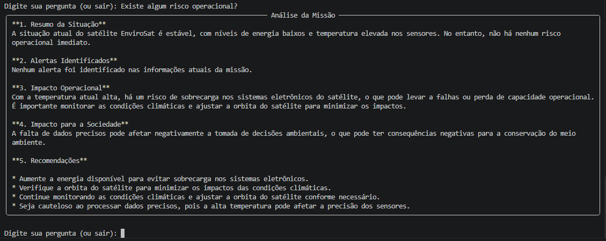

# Mission Control AI — EnviroSat

## Integrantes

* Nathan de Mello Teixeira — RM567429
* Victor Puglia Neves — RM567854

---

# Sobre o Projeto

O EnviroSat é um sistema inteligente de monitoramento ambiental inspirado em satélites de observação terrestre, como Amazônia-1 e Landsat.

A plataforma coleta dados simulados de telemetria, identifica situações críticas através de regras implementadas em Python e utiliza Inteligência Artificial Generativa para transformar informações técnicas em análises compreensíveis para operadores ambientais.

O objetivo é apoiar a tomada de decisão em cenários de monitoramento ambiental, auxiliando na identificação de queimadas, desmatamento e falhas operacionais que possam comprometer a missão.

---

# Persona Atendida

**Operador de Centro de Controle Ambiental**

Esse profissional acompanha queimadas, desmatamento, áreas protegidas e eventos climáticos utilizando dados provenientes de satélites de observação da Terra.

Sua principal necessidade é identificar rapidamente situações críticas e compreender seus impactos operacionais e ambientais para apoiar a tomada de decisão.

---

# Dados Monitorados

* Temperatura do sensor térmico
* Energia disponível
* Precisão de geolocalização
* Buffer de imagens não transmitidas
* Integridade do sensor óptico

---

# Tecnologias Utilizadas

* Python 3.10+
* Ollama
* Llama 3.2
* Python-dotenv
* Rich
* PyFiglet

---

# Estrutura do Projeto

```text
Mission-Control-AI-EnviroSat-main
│
├── assets/
│   ├── tela_inicial.png
│   ├── estado_missao.png
│   ├── analise_sensores.png
│   └── risco_operacional.png
│
├── data/
│   └── cenarios.json
│
├── prompts/
│   └── system_prompt.md
│
├── src/
│   ├── alertas.py
│   ├── engine.py
│   ├── telemetria.py
│   ├── ui.py
│   └── __init__.py
│
├── main.py
├── requirements.txt
└── README.md
```

---

# Resultados Obtidos

O sistema foi capaz de:

* Simular telemetria de um satélite ambiental.
* Detectar automaticamente situações críticas.
* Gerar alertas operacionais.
* Utilizar Inteligência Artificial Generativa para interpretar os dados.
* Produzir recomendações para operadores ambientais.
* Demonstrar a integração entre Python, Engenharia de Software e IA Generativa.

Os testes realizados mostraram o correto funcionamento dos módulos de coleta de telemetria, geração de alertas e análise inteligente da missão.

---

# Integração com IA

O projeto utiliza o modelo **Llama 3.2** através do **Ollama**.

Os dados de telemetria são coletados dinamicamente pelo sistema e inseridos no prompt enviado ao modelo.

A IA recebe:

* Temperatura
* Energia
* Precisão de geolocalização
* Buffer de imagens
* Estado do sensor óptico
* Alertas gerados em Python

Com base nesses dados, produz análises operacionais, avaliação de riscos e recomendações para os operadores da missão.

---

# Como Executar

## 1. Clone o repositório

```bash
git clone https://github.com/seuusuario/mission-control-ai.git
```

## 2. Acesse a pasta do projeto

```bash
cd mission-control-ai
```

## 3. Crie um ambiente virtual

```bash
python -m venv .venv
```

## 4. Ative o ambiente virtual

### Windows

```bash
.venv\Scripts\activate
```

### Linux/Mac

```bash
source .venv/bin/activate
```

## 5. Instale as dependências

```bash
pip install -r requirements.txt
```

## 6. Instale o modelo no Ollama

```bash
ollama pull llama3.2
```

## 7. Execute o projeto

```bash
python main.py
```

---

# Cenários Testados

## Cenário 1 — Operação Normal

Todos os sensores funcionando dentro dos parâmetros esperados.

## Cenário 2 — Temperatura Crítica

Sensor térmico acima do limite operacional.

## Cenário 3 — Energia Crítica

Bateria abaixo de 20%.

## Cenário 4 — Falha de Geolocalização

Erro na precisão de posicionamento.

## Cenário 5 — Sensor Óptico Crítico

Falha no principal sensor responsável pelo monitoramento ambiental.

---

# Evolução do Prompt

## Versão 1

Prompt genérico para análise de telemetria.

## Versão 2

Inclusão de contexto ambiental e monitoramento de queimadas.

## Versão 3

Inclusão de impacto social, classificação de risco e recomendações operacionais.

---

# Proposta de Valor

## Qual problema resolve?

Permite detectar queimadas e desmatamentos com maior rapidez, auxiliando equipes ambientais na tomada de decisões.

## Quem paga?

Órgãos ambientais, governos estaduais, IBAMA e empresas privadas de monitoramento ambiental.

## Métrica de Impacto

Monitoramento de até 500 mil hectares por ano, reduzindo o tempo de resposta a focos de incêndio.

## Modelo de Negócio

Data as a Service (DaaS) por assinatura.

---

# Limitações

* Dados simulados.
* Não utiliza sensores reais.
* Dependência do Ollama instalado localmente.
* Projeto desenvolvido para fins acadêmicos.

---

# Demonstração

## Tela Inicial



## Estado Atual da Missão



## Análise Completa dos Sensores



## Avaliação de Risco Operacional



---

# Vídeo de Demonstração

Exemplo:

https://youtube.com/seu-video

---

# Conclusão

O Mission Control AI — EnviroSat demonstra como a Inteligência Artificial Generativa pode ser integrada a sistemas de monitoramento ambiental para apoiar operadores na interpretação de dados de telemetria e na identificação de situações críticas.

A solução combina simulação de sensores, geração automática de alertas e análise inteligente por IA, oferecendo uma experiência próxima à de centros reais de monitoramento de missões espaciais e ambientais.
